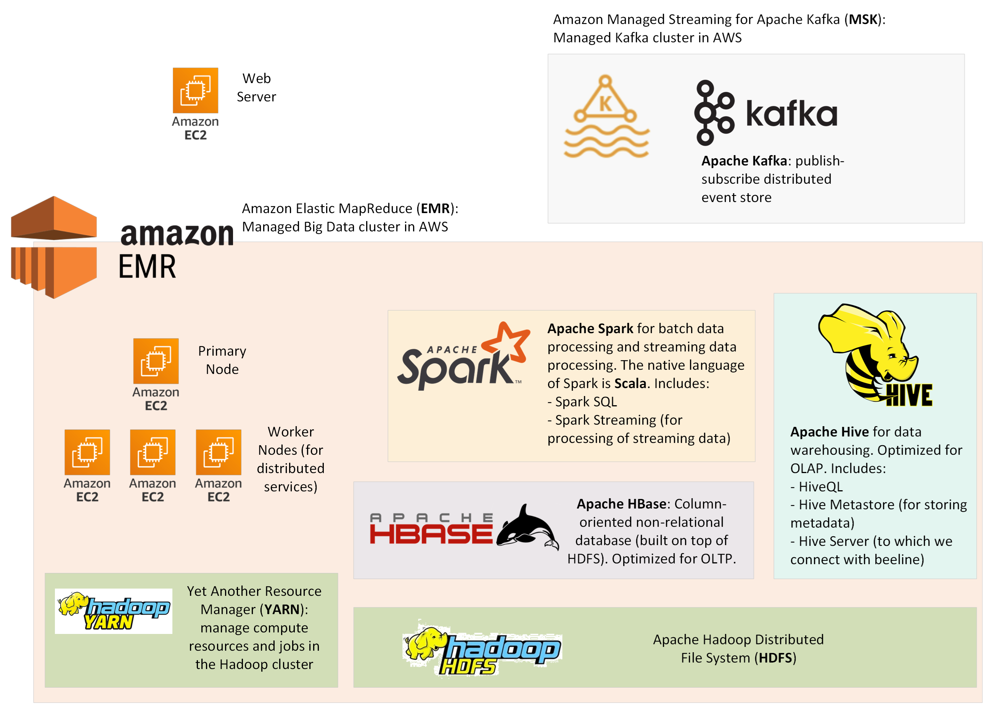

# Tracking 10-Year US Real Estate Market Data by Zip Code

## Introduction

A Big Data Application built with

- Over 7.4 Million data records covering 10-year US real estate market transaction information at zipcode level
- Over 42 Thousand data records covering all US zipcode and corresponding primary city information
- Implemented using a Lambda Architecture (Batch Layer, Serving Layer, Speed Layer)
- Tools used: AWS EMR, Hadoop, Hive, Spark, HBase, Node.js, Kafka

## Data Preparation

### Data Ingestion

Download Data (source: Redfin Data Portal)

Transform tsv000 data to csv and obtain basic understanding of the source data (size, parameters, scope, etc...) using python

Ingest to AWS EMR Cluster using scp

HDFS File Structure:

```
./yvesyang
    /zipcode
        /zipcode_city.csv
    /new_2023_data
        /zip_market_after_2023.csv
    /history_data
        /zip_market_before_2023.csv
```

### Data Manipulation

Launch Hive in EMR: beeline -u jdbc:hive2://localhost:10000/default -n hadoop -d org.apache.hive.jdbc.HiveDriver

#### Hive Table

Create Hive Table from raw source csv files

- yvesyang_market_csv: contains all market data before 2023
- yvesyang_market_update_csv: contains all market data after 2023
- yvesyang_zipcode: contains US zipcode and corresponding primary city information

- yvesyang_market_orc: rewrite the yvesyang_before2023_csv table into ORC format
  https://orc.apache.org/docs/

Join US zipcode-city data and US Housing Market data to enable user's query by both zipcode and city name

- yvesyang_market_and_zip

#### HBase Table

Extract Essential Data from the combined hive big table and Write to HBase

Launch HBase using "hbase shell"
Create HBase table:
create 'yvesyang_zip_estate', 'md'

Write Essential Data to HBase for user query

## Data Presentation

### Query

To query HBase, use HBase' REST interface, Creating a tunnel on port 8070

ssh -i ~/.ssh/yvesyang_mpcs53014.pem -L 8070:ec2-3-131-137-149.us-east-2.compute.amazonaws.com:8070 hadoop@ec2-3-131-137-149.us-east-2.compute.amazonaws.com

Node.js Application using JavaScript

Open localhost:8070

### Map Demonstration

Add openstreetmap

## Data Streaming

### Web Submission

Create submit-data.html for market updates submission

### Kafka

Add openstreetmap

## Video Demo

(to update)
[](https://youtu.be/mTe6FmaFXeo)

## Snapshot




