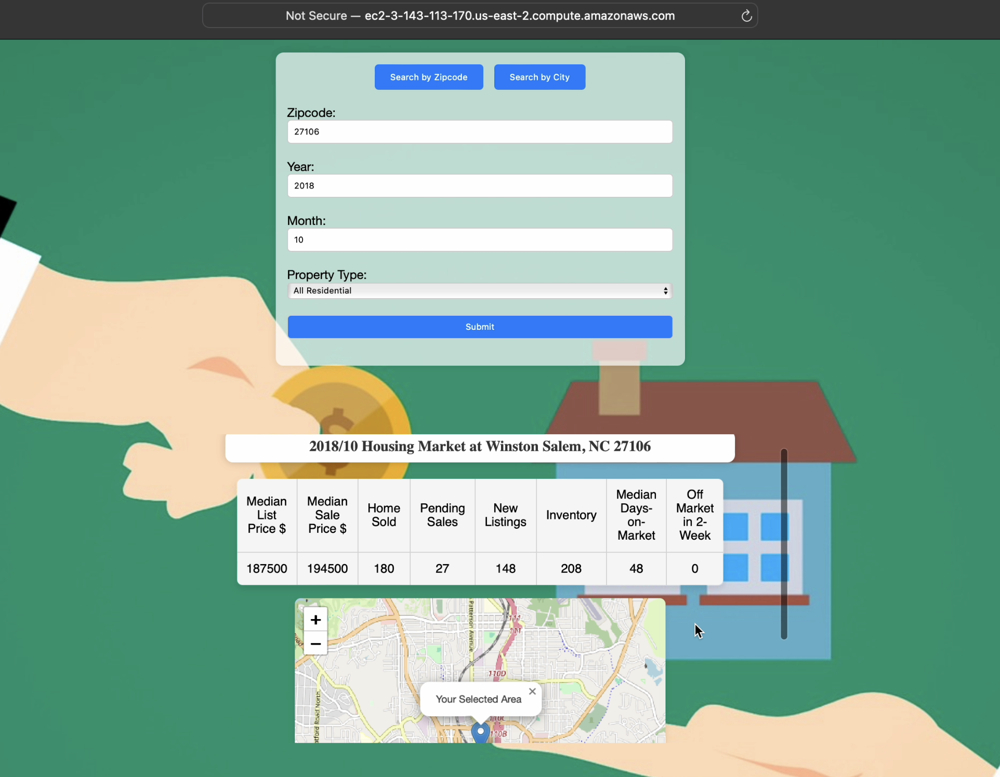
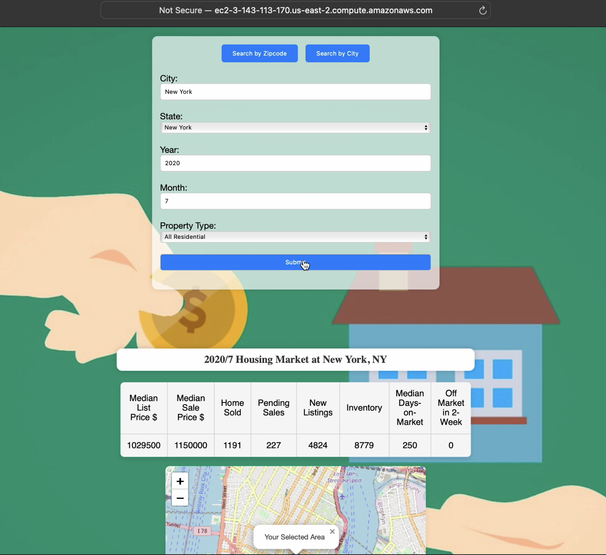
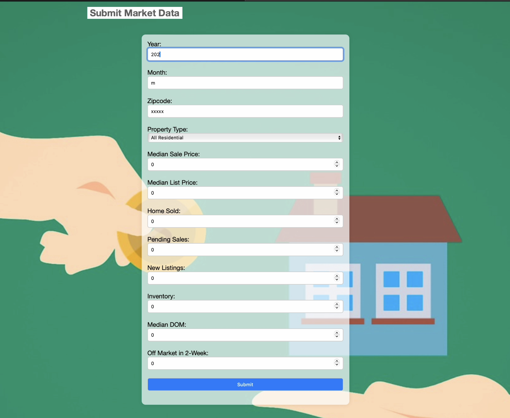
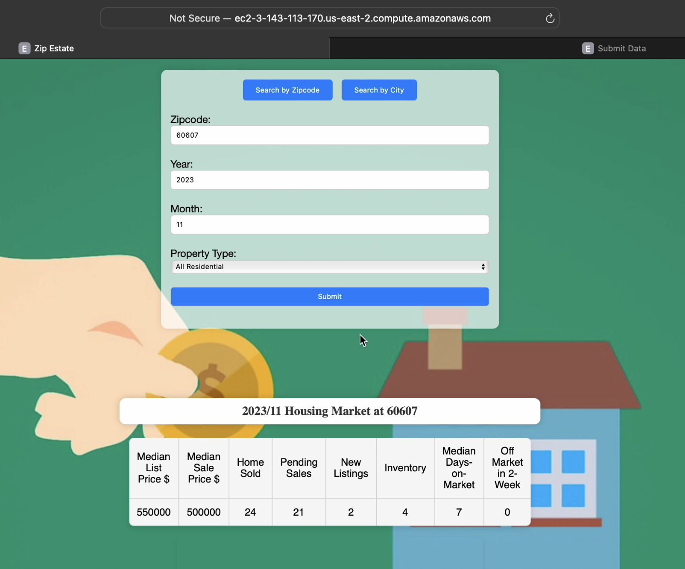

# Tracking 10-Year US Real Estate Market Data by Zip Code

## Introduction

A Big Data Application built with

- 🏠 Over 7.4 Million data records covering 10-year (2012-2022) US real estate market data at zipcode level
- 📫 Over 42 Thousand data records covering all US zipcode and corresponding primary city information
- Implemented using a [Lambda Architecture](https://www.databricks.com/glossary/lambda-architecture) (Batch Layer, Serving Layer, Speed Layer)
- Tools used:

  Raw Data Preprocessing: [Redfin Data Portal](https://www.redfin.com/news/data-center/), [Python](https://www.python.org)

  Data Preparation: [AWS EMR](https://aws.amazon.com/emr/), [Hadoop](https://hadoop.apache.org), [Hive](https://hive.apache.org), [Spark](https://spark.apache.org)

  Data Presentation: [Express.js](https://expressjs.com), [HBase](https://hbase.apache.org)

  Data Streaming: [Kafka](https://kafka.apache.org), [Spark](https://spark.apache.org)

- [Github Source](https://github.com/531Yvonne/ZipEstate)

## Video Demo

[](https://youtu.be/1ohA5c7-BMU)

## App Snapshots







# User Instruction

## Application Part

### 1.Deploy/Upload the zip_estate_app file to your ec2-user server

### 2.Connect to your ec2-user server

for example: `ssh -i ~/.ssh/yvesyang_mpcs53014.pem ec2-user@ec2-3-143-113-170.us-east-2.compute.amazonaws.com`

### 3.Run below in the ec2-user server to launch the application

```
cd yvesyang/zip_estate/

npm install

node app.js 3059 ec2-3-131-137-149.us-east-2.compute.amazonaws.com 8070 b-1.mpcs53014kafka.o5ok5i.c4.kafka.us-east-2.amazonaws.com:9092
```

### 4.Try Query

http://ec2-3-143-113-170.us-east-2.compute.amazonaws.com:3059

## Streaming Part

### 1.Maven Install the Spark application and Deploy to the Hadoop Cluster

### 2.Connect to your hadoop server

for example: `ssh -i ~/.ssh/yvesyang_mpcs53014.pem hadoop@ec2-3-131-137-149.us-east-2.compute.amazonaws.com`

### 3.Run below in the hadoop server to launch the real time processing from Kafka to Hbase

```
cd yvesyang/project_speed_layer/target/

spark-submit --master local[2] --driver-java-options "-Dlog4j.configuration=file:///home/hadoop/ss.log4j.properties" --class StreamUpdates uber-process_data_updates-1.0-SNAPSHOT.jar b-1.mpcs53014kafka.o5ok5i.c4.kafka.us-east-2.amazonaws.com:9092
```

### 4.Try Submission

http://ec2-3-143-113-170.us-east-2.compute.amazonaws.com:3059/submit-data.html

### 5.Try Searching for the new updates

http://ec2-3-143-113-170.us-east-2.compute.amazonaws.com:3059

# Technical Details

## Data Preparation

### Data Preprocessing

- Download Data source: [Redfin Data Portal](https://www.redfin.com/news/data-center/)
- Transform raw tsv000 data to csv and obtain basic understanding of the source data (size, parameters, scope, etc...) using Python. ([Market Data Workbook](./raw_data_processing/market_data_cleaning.ipynb), [Zip Data Workbook](./raw_data_processing/zipcode_cleaning.ipynb))

### Data Ingestion

- Ingest to AWS EMR Cluster using `scp`

- HDFS File Structure:

```
  ./yvesyang
    /zipcode
        /zipcode_city.csv
    /history_data
        /zip_market_before_2023.csv
```

### Data Manipulation

Launch Hive in AWS EMR:
`beeline -u jdbc:hive2://localhost:10000/default -n hadoop -d org.apache.hive.jdbc.HiveDriver`

#### Batch Layer with Hive Table

Create Hive Table from raw source csv files

- yvesyang_market_csv: contains all market data before 2023 ([Hive Code](./data_preparation/hive_market.hql))
- yvesyang_zipcode: contains US zipcode and corresponding primary city information ([Hive Code](./data_preparation/hive_zipcode.hql))
- yvesyang_market_orc: rewrite the yvesyang_market_csv table into [ORC](https://orc.apache.org/docs/) format ([Hive Code](./data_preparation/hive_market.hql))

Join US zipcode-city data and US Housing Market data to enable user's query by both zipcode and city name

- yvesyang_market_and_zip ([Hive Code](./data_preparation/market_and_zip.hql))

## Data Serving and Presentation

### Serving Layer with HBase Table

Launch HBase using `hbase shell` and create two HBase tables for different queries:

- `create 'yvesyang_zip_estate', 'md'`
- `create 'yvesyang_city_estate', 'mdc'`

Extract Essential Data from the combined hive big table and Write to HBase.[(HQL Code)](./data_preparation/by_zip_write_to_hbase.hql)

Additionally, extract market data at City level using Spark Scala and Write to HBase
Create HBase table: [(Scala Code)](./data_preparation/by_city_write_to_hbase.scala)

### Data Quality Consideration between Batch and Speed Layer

An extra column "from_batch_layer" was created, to flag whether the HBase table data record is from reliable Batch Layer Hive Table, or from Kafka real time streaming.

### Web Application

- Developed a Node.js Application using JavaScript.

- Multiple Queries: Enable query by zipcode, query by city. (User can select ideal mode from tab bar)

- Map Demonstration: Utilize openstreetmap and existing longitude, latitude data to generate marked map based on user query.

## Data Updates and Streaming

### Kafka

Create a new topic yvesyang_data_updates in Kafka to catch real-time data submission made at submit-data.html

```
./kafka-topics.sh --create --zookeeper z-3.mpcs53014kafka.o5ok5i.c4.kafka.us-east-2.amazonaws.com:2181,z-1.mpcs53014kafka.o5ok5i.c4.kafka.us-east-2.amazonaws.com:2181,z-2.mpcs53014kafka.o5ok5i.c4.kafka.us-east-2.amazonaws.com:2181 --replication-factor 2 --partitions 1 --topic yvesyang_data_updates
```

Use the console consumer to see new data record :

```
./kafka-console-consumer.sh --bootstrap-server b-1.mpcs53014kafka.o5ok5i.c4.kafka.us-east-2.amazonaws.com:9092 --topic yvesyang_data_updates --from-beginning
```

### Web Submission

Create submit-data.html for market updates submission

```
ssh -i ~/.ssh/yvesyang_mpcs53014.pem ec2-user@ec2-3-143-113-170.us-east-2.compute.amazonaws.com

cd yvesyang/zip_estate/

npm install

node app.js 3059 ec2-3-131-137-149.us-east-2.compute.amazonaws.com 8070 b-1.mpcs53014kafka.o5ok5i.c4.kafka.us-east-2.amazonaws.com:9092
```

Submit data updates manually at:
http://ec2-3-143-113-170.us-east-2.compute.amazonaws.com:3059/submit-data.html

### Data Streaming

Write Spark Application using Scala to Stream Kafka Data Updates to Hbase: [StreamUpdates Code](./process_data_updates/src/main/scala/StreamUpdates.scala)

When write updates to HBase, the HBase extra column "from_batch_layer" will be False, in order to mark the new HBase table record is from real time data updates. When monthly official data is generated and ingested to batch layer, remove any HBase rows flagged as "not from batch layer" to maintain data integrity and avoid duplicates.

Maven Install the Spark application and Deploy to the Hadoop Cluster

```
ssh -i ~/.ssh/yvesyang_mpcs53014.pem hadoop@ec2-3-131-137-149.us-east-2.compute.amazonaws.com

cd yvesyang/project_speed_layer/target/

spark-submit --master local[2] --driver-java-options "-Dlog4j.configuration=file:///home/hadoop/ss.log4j.properties" --class StreamUpdates uber-process_data_updates-1.0-SNAPSHOT.jar b-1.mpcs53014kafka.o5ok5i.c4.kafka.us-east-2.amazonaws.com:9092
```
